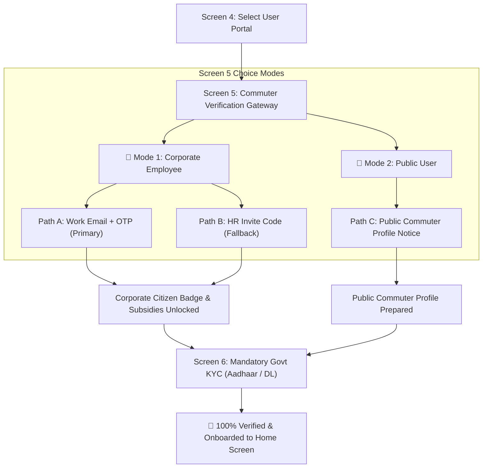

# 🏢 Screen 5: Commuter Verification & Identity Gateway — Specification & Test Cases
### (Corporate Employee vs Public User Verification)

---

## 1. Overview
* **File Target:** `lib/screens/auth/corporate_verify_screen.dart`
* **Purpose:** To determine and verify the commuter's identity profile. 
  * **Corporate Employee:** Unlocks company master Karma Coin subsidies, the Corporate Citizen Badge, and colleague-to-colleague priority pooling.
  * **Public User:** Activates the open commuter carpooling & bike-pooling network.
* **Placement:** Occurs immediately after Screen 4 (Role Selection / Choose Your Journey) when the user selects the **"User"** portal.
* **Critical Security Principle (Pre-Onboarding KYC):** **Both user types MUST complete mandatory Government KYC (Screen 6: Aadhaar / Driving License) before onboarding to the app.** Zero unverified or anonymous users are ever permitted into the active ride pool.

---

## 2. Core Business Logic & State Workflows

### A. The Two Commuter Identity Modes

#### 🏢 Mode 1: Corporate Employee (Company Commuter)
1. **Path A (Primary): Work Email + Magic OTP**
   - User enters their corporate email (`name@tcs.com`, `name@infosys.com`).
   - System validates format and rejects blacklisted public domains (`@gmail.com`, `@yahoo.com`, `@outlook.com`, `@rediffmail.com`, etc.).
   - Live company auto-resolution displays a recognized company badge (e.g., `🏢 Recognized: Infosys Technologies`).
   - Dispatches a 6-digit OTP to the work email with a 60-second resend timer.
   - On OTP success: Awards the **"Corporate Citizen"** badge, links company coin subsidies, and proceeds to **Screen 6 (Mandatory Govt KYC)**.
2. **Path B (Fallback): HR Invite Code**
   - For companies whose IT firewalls block external OTPs, user enters a 6-character alphanumeric code (e.g., `INFY26`).
   - On code validation: Links company profile and proceeds to **Screen 6 (Mandatory Govt KYC)**.

#### 🌟 Mode 2: Public User (Open Network Commuter)
1. **Path C: Standard Commuter Network**
   - Designed for daily commuters who do not work at a registered corporate tech park.
   - Highlights Public Commuter benefits: Open route matching across all verified peers, standard Karma Coin economy, and safety protocols.
   - Displays clear action button: **"Continue to Govt Verification"**.
   - Proceeds immediately to **Screen 6 (Mandatory Govt KYC)**.

---

### B. UI/UX Elements (Screen 2 Golden Base Design System)
* **Canvas:** Deep Midnight Navy `#050814` background.
* **Ambient Background:** Live cosmic `StarRain1` stardust rain animation.
* **Top J.A.R.V.I.S. HUD:** Animated holographic reactor with `Icons.apartment_rounded` and status pill `SYS.AUTH // HR_VERIFY`.
* **Selection Mode Tabs:** Sleek glass pill toggle between **`🏢 Corporate Employee`** and **`🌟 Public User`**.
* **Input Fields:** Glowing neon text boxes with cyan focus glow (`#00E5FF`).
* **OTP Matrix:** 6-box rounded glass matrix with auto-advance and clipboard smart regex parsing.
* **Error & Success Physics:** Sine-wave horizontal shake animation on invalid OTP/code + haptic feedback.

---

## 3. Exhaustive Test Cases (32 Cases across 7 Categories)

### Category 1: UI Initialization & Mode Selection
| Test ID | Scenario | Expected Behavior |
|---|---|---|
| **TC-5.01** | Screen loads initially | "Corporate Employee" tab is selected by default. Work Email input is auto-focused with keyboard open. |
| **TC-5.02** | Keyboard persistence | Tapping outside any input box gracefully dismisses the keyboard. |
| **TC-5.03** | Mode Selector Toggle | Allows instant switching between **"Corporate Employee"** and **"Public User"** modes. |
| **TC-5.04** | Public User Card Visibility | Selecting "Public User" hides email inputs and displays the Public Commuter safety card + "Continue to Govt Verification" CTA. |

### Category 2: Email Validation & Domain Detection (Corporate Mode)
| Test ID | Scenario | Expected Behavior |
|---|---|---|
| **TC-5.05** | Enter invalid email format | Typing `amit@infosys` (missing TLD) disables "Send OTP" button. |
| **TC-5.06** | Enter public domain (`@gmail.com`) | Shows red inline warning: *"Public domains not allowed. Please enter your work email."* |
| **TC-5.07** | Enter other public domains (`@yahoo.com`, `@outlook.com`) | Same red inline error. Button remains disabled. |
| **TC-5.08** | Enter valid corporate domain | Typing `amit@infosys.com` activates the glowing cyan "Send OTP" button. |
| **TC-5.09** | Enterprise domain auto-resolution | Resolves and displays company badge (e.g., `🏢 Recognized: Infosys Technologies`). |
| **TC-5.10** | Copy/Paste email | Pasting a valid email triggers instant validation without extra keystroke. |

### Category 3: OTP Dispatch & Resend Timers
| Test ID | Scenario | Expected Behavior |
|---|---|---|
| **TC-5.11** | Tap "Send OTP" | Transitions smoothly to 6-box OTP matrix. Loading spinner prevents duplicate requests. |
| **TC-5.12** | OTP Sent UI update | Displays *"OTP sent to amit@infosys.com"* with an edit button `(✏️)`. |
| **TC-5.13** | Initial Resend Timer | Starts 60-second countdown before "Resend OTP" becomes active. |
| **TC-5.14** | Tap Resend after 60s | Resets timer to 120 seconds and dispatches fresh OTP. |
| **TC-5.15** | Tap Edit Email `(✏️)` | Returns to email editing state, clearing OTP matrix and resetting timers. |

### Category 4: OTP Input Matrix & Clipboard Smart Parsing
| Test ID | Scenario | Expected Behavior |
|---|---|---|
| **TC-5.16** | Type 1 digit in Box 1 | Focus advances automatically to Box 2. |
| **TC-5.17** | Press Backspace on empty Box 2 | Focus jumps back to Box 1 and clears its value. |
| **TC-5.18** | Paste 6-digit OTP (`123456`) | Digits distribute across all 6 boxes; verification triggers automatically. |
| **TC-5.19** | Paste 8-digit string (`12345678`) | Extracts first 6 digits and distributes to boxes. |
| **TC-5.20** | Paste conversational SMS (`"OTP is 556677"`) | Regex extracts `556677` and fills all 6 boxes. |

### Category 5: Verification Physics & Security Lockout
| Test ID | Scenario | Expected Behavior |
|---|---|---|
| **TC-5.21** | Enter wrong OTP | Triggers haptic feedback + horizontal Sine-wave shake animation. |
| **TC-5.22** | Wrong OTP UI State | Boxes outline in red, digits clear, and focus returns to Box 1. |
| **TC-5.23** | 3 consecutive wrong OTPs | 5-minute security lockout timer activates; OTP inputs disable. |
| **TC-5.24** | Enter correct OTP | Displays 1.2s green checkmark animation + "Corporate Citizen" badge. |
| **TC-5.25** | Network Disconnect | Shows floating snackbar: *"No internet connection. Retrying..."* |

### Category 6: HR Gate & Mandatory Govt KYC Routing
| Test ID | Scenario | Expected Behavior |
|---|---|---|
| **TC-5.26** | Corporate Verification Success | Auto-routes to **Screen 6 (Mandatory Govt KYC / Aadhaar)** with corporate status attached. |
| **TC-5.27** | Public User "Continue" Tapped | Shows *"Public Commuter Mode Activated"* and auto-routes to **Screen 6 (Mandatory Govt KYC / Aadhaar)**. |
| **TC-5.28** | Mandatory Onboarding Gate | Confirms no user can enter main ride pool without completing Screen 6 Govt KYC. |

### Category 7: HR Invite Code Fallback Flow
| Test ID | Scenario | Expected Behavior |
|---|---|---|
| **TC-5.29** | Switch to Invite Code | Opens 6-character uppercase alphanumeric input box (auto-capitalized). |
| **TC-5.30** | Type 6 valid characters | "Verify Code" button activates. |
| **TC-5.31** | Enter invalid code | Triggers shake animation + *"Invalid or Expired Code"* error. |
| **TC-5.32** | Enter valid code (`INFY26`) | Green success checkmark $\to$ Auto-routes to **Screen 6 (Govt KYC)**. |

---

## 4. Database Schema Impact (Supabase PostgreSQL)
When this gateway completes:
* **For Corporate Employee:**
  * `users.user_type` = `'corporate_employee'`
  * `users.work_email` = `'entered_email'`
  * `users.company_id` = matched company UUID
  * `users.corporate_status` = `'verified'` (or `'pending_hr_approval'`)
  * `users.is_kyc_completed` = `false` *(updated to `true` on Screen 6)*
* **For Public User:**
  * `users.user_type` = `'public_user'`
  * `users.company_id` = `NULL`
  * `users.corporate_status` = `'none'`
  * `users.is_kyc_completed` = `false` *(updated to `true` on Screen 6)*
